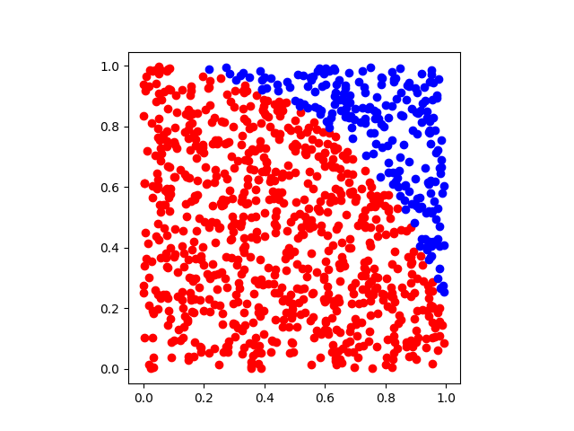

# Monte-Carlo
Projects/Simulations I created while studying Monte Carlo Methods

# Estimating the Value of Pi Using Monte Carlo Methods
   

   

# Simulating European Call Options Using Monte Carlo Methods
